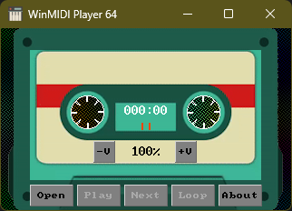
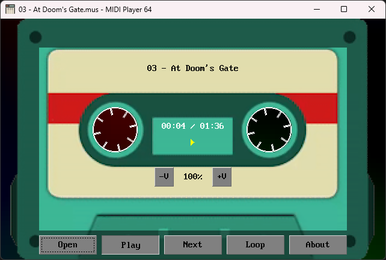

# WINMIDI PLAYER 64

This is a [QB64-PE](https://www.qb64phoenix.com/) compatible MIDI player library that uses [Win32 WinMM MIDI streaming APIs](https://docs.microsoft.com/en-us/windows/win32/api/mmeapi/).




## FEATURES

- Easy plug-&-play API optimized for demos & games (without pulling in the full QB64-PE audio library)
- Works with both 64-bit and 32-bit QB64-PE complier
- Everything is statically linked (no DLL dependency; unlike [this](https://qb64phoenix.com/qb64wiki/index.php/DLL_Libraries))
- Demo player that shows how to use the library
- Contains a simple asynchronous ACM compressed .WAV player that supports looping (great for background .WAV music)

## USAGE

- Clone the repository to a directory of your choice
- Open Terminal and change to the directory using an appropriate OS command
- Run `git submodule update --init --recursive` to initialize, fetch and checkout git submodules
- Open *WinMIDIPlayer64.bas* in the QB64-PE IDE and press `F5` to compile and run
- To use the library in your project add the [Toolbox64](https://github.com/a740g/Toolbox64) repository as a [Git submodule](https://git-scm.com/book/en/v2/Git-Tools-Submodules)

## API

```VB
Function MIDI_PlayFromMemory%% (buffer As String)
Sub MIDI_PlayFromMemory (buffer As String)
Function MIDI_PlayFromFile%% (fileName As String)
Sub MIDI_PlayFromFile (fileName As String)
Sub MIDI_Stop
Function MIDI_IsPlaying%%
Sub MIDI_SetLooping (loops As Long)
Function MIDI_IsLooping%%
Sub MIDI_SetPause (pause As Byte)
Function MIDI_IsPaused%%
Sub MIDI_SetVolume (volume As Single)
Function MIDI_GetVolume!
Function Sound_PlayFromMemory%% (buffer As String, looping As Byte)
Sub Sound_PlayFromMemory (buffer As String, looping As Byte)
Function Sound_PlayFromFile%% (fileName As String, looping As Byte)
Sub Sound_PlayFromFile (fileName As String, looping As Byte)
Sub Sound_Stop
Sub Sound_Beep (dwFreq As Unsigned Long, dwDuration As Unsigned Long)
```

## NOTES

- This requires the latest version of [QB64-PE](https://github.com/QB64-Phoenix-Edition/QB64pe/releases/latest)
- This works on Windows only because it makes use of the Windows API
- To use something more cross-platform use QB64-PE's native [_SNDOPEN](https://qb64phoenix.com/qb64wiki/index.php/SNDOPEN)
- When you clone a repository that contains submodules, the submodules are not automatically cloned by default
- You will need to use the `git submodule update --init --recursive` to initialize, fetch and checkout git submodules
- This can be used when you just need simple sound and MIDI playback under Windows and do not want to pull in the full QB64-PE audio library

## ASSETS

- [Icon](https://www.iconarchive.com/artist/grafikartes.html) by [Paulo Freitas](https://behance.net/grafikartes)
