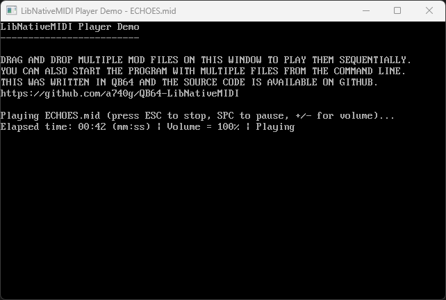

# What is this?

This is a [QB64](https://github.com/QB64-Phoenix-Edition/QB64pe) compatible MIDI player library that uses [Win32 WinMM MIDI streaming APIs](https://docs.microsoft.com/en-us/windows/win32/api/mmeapi/).



## Features

- Easy plug-&-play API optimized for demos & games
- Works with both 64-bit and 32-bit QB64 complier
- Everything is statically linked (no DLL dependency, unlike [this](https://qb64phoenix.com/qb64wiki/index.php/DLL_Libraries))
- Demo player that shows how to use the library

## API

```VB
Function MIDI_Play%% (fileName As String, Byval loops As Long)
Function MIDI_IsPlaying%%
Sub MIDI_Pause
Sub MIDI_Resume
Sub MIDI_SetVolume (ByVal volume As Single)
```

## Important note

- Since the entire library was written using C, it expects null-terminated strings. Hence, always null-terminate `fileName` when using `MIDI_Play()`
- Executing `MIDI_Play(Chr$(0), 0)` will shutdown the library. This should be done before the program ends
- MIDI support is built into [QBPE with miniaudio backend](https://github.com/a740g/QBPE). The [miniaudio](https://miniaud.io/) backend in this version of OBPE uses [TinySoundFont](https://github.com/schellingb/TinySoundFont), [TinyMidiLoader](https://github.com/schellingb/TinySoundFont) and [soundfonts](https://en.wikipedia.org/wiki/SoundFont). So, this should be used when using older version of QB64 or when we want to eliminate the extra storage used by soundfonts
- This works on Windows only
